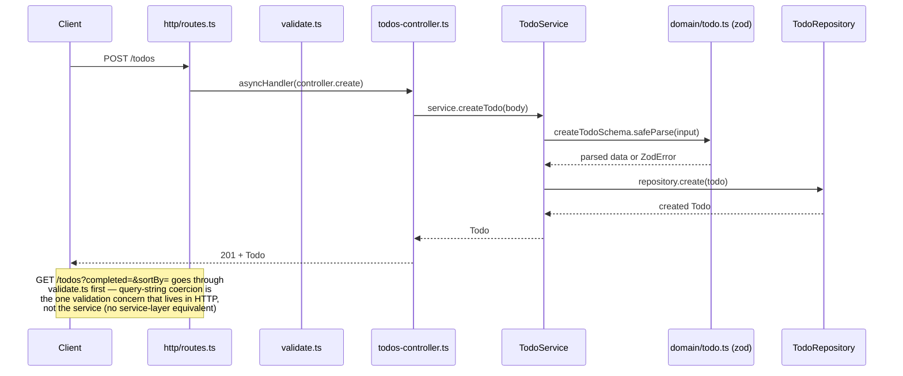

# Architecture

Deeper technical dive than the README's condensed "Design choices" section — this is the
document to read to actually understand how a request moves through the system, not just why
the layers exist.

## Layers

```
src/
  domain/        Todo type + zod validation schemas — no knowledge of HTTP or storage
  errors/        NotFoundError, ValidationError — typed, caught centrally
  repository/    TodoRepository interface + InMemoryTodoRepository + JsonFileTodoRepository
  services/      TodoService — business rules, validates via domain schemas directly
  http/          routes, controllers, middleware — the only layer that knows it's HTTP
  app.ts         createApp(repository) factory — no side-effecting listen()
  server.ts      real entrypoint: createApp() + JsonFileTodoRepository + listen()
```

Each layer depends only on the layer below it, and only through an interface where one exists.
`services/todo-service.ts` imports `repository/todo-repository.ts` (the interface) — never
`in-memory-todo-repository.ts` or `json-file-todo-repository.ts` directly. That single fact is
what makes the repository swappable and the service layer testable with zero I/O.

## Request flow



Errors don't get formatted at the point they're thrown. `NotFoundError`/`ValidationError` (or an
unexpected error) propagate up through `asyncHandler` to `error-handler.ts`, which is the single
place that maps an error to an HTTP status and the `{ error: { message, code, issues? } }` shape.
Controllers never construct that shape themselves.

## Why validation lives in two places, not one

- **Request bodies** (`POST`/`PUT`) are validated inside `TodoService`, directly against the zod
  schemas in `domain/todo.ts`. This is deliberate: the service needs to be safe to call from any
  caller, not just an Express request that happened to pass through middleware first, and it's
  what lets "required title," "unknown field rejected," etc. be unit-tested with zero HTTP.
- **Query-string params** (`GET /todos?completed=&sortBy=`) are validated in
  `http/middleware/validate.ts` against `list-query-schema.ts`. This one genuinely belongs in
  the HTTP layer — coercing a query string into a typed filter has no service-layer equivalent,
  since `TodoService.listTodos()` already receives a typed filter object, not raw strings.

Two validation call sites, but zero duplicated validation logic between them.

## Storage: the actual swap point

`TodoRepository` is five methods: `findAll`, `findById`, `create`, `update`, `remove`. Both
implementations are checked against the same shared contract test
(`repository/todo-repository.contract.ts`), so a change to one repository's behavior that
diverges from the other's gets caught by a test failure, not a production surprise.

- **`InMemoryTodoRepository`** — a `Map`, used by every test in the domain/service/http tiers.
  Zero I/O, so those tests run in milliseconds.
- **`JsonFileTodoRepository`** — reads/writes a single JSON array to disk. Writes are serialized
  through a promise-chain queue (`enqueueWrite`) so concurrent write requests can't interleave a
  read-modify-write cycle and corrupt the file. (Reads are *not* currently covered by that same
  queue — see [issue #12](../../issues/12) for the known gap this creates under concurrent
  read/write load.)

Swapping which one `server.ts` constructs is the entire migration path to a real database later
— nothing in `services/` or `http/` would need to change.
